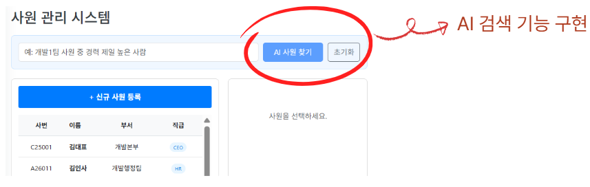

# 🚀 IT HR Web Solution with LLM
> **LLM을 활용한 지능형 IT HR 웹 솔루션:**
> 개발자 직무 특성에 최적화된 맞춤형 인사 관리 및 프로젝트 협업 툴입니다.

<div align="center">
  
  
  
</div>

<br/>

## 🎬 Project Preview & Documents
<div align="center">
  
  <br/><br/>
  
  <table>
    <tr>
      <td align="center"><b>📊 발표 PPT</b></td>
      <td align="center"><b>📋 테이블 명세서</b></td>
      <td align="center"><b>🗺️ ERD</b></td>
    </tr>
    <tr>
        <td align="center"><br/>
            <a href="assets/솔데스크%20HR_김재현.pptx" download>📁 다운로드 (PPTX)</a>
        </td>
        <td align="center"><br/><a href="assets/HR_테이블명세서_최종.xlsx" download>📁 다운로드 (XLSX)</a></td>
        <td align="center"><br/>
            <a href="assets/인사관리%20ERD.png" target="_blank">📁 크게보기 (PNG)</a>
        </td>
    </tr>
  </table>
</div>

### [🎥 시연 영상 보기](https://github.com/RunSBS/hr-emp-dept-team/issues/1#issue-3889153264)

---
## 📌 1. Project Overview (프로젝트 개요)

- **프로젝트 제목**: LLM을 활용한 IT HR 웹 솔루션
- **프로젝트 설명**: LLM을 활용하여 IT회사의 사내 개발자들을 대상으로 하는 지능형 HR 웹 솔루션을 개발
- **주제 선정 배경 및 차별점**:
  - 기존의 HR은 개발자들을 위한 맞춤 기능들이 부족
  - 개발자들의 업무 특성에 맞는 기능들을 LLM을 활용하여 구현

<br/>

## 👥 2. Team Members (팀원 및 팀 소개)

| **김재현 (PM)** | **김민영 (PL)** | **김경은 (FE)** | **전현규 (DB)** | **강규호 (AI)** |
| :---: | :---: | :---: | :---: | :---: |
|  |  |  |  |  |
| [@RunSBS](https://github.com/RunSBS) | [@clem0927](https://github.com/clem0927) | [@KKEUN22](https://github.com/KKEUN22) | [@JeonHyunGyu](https://github.com/JeonHyunGyu) | [@Kangkyuho](https://github.com/Kangkyuho) |
| <ul style="text-align: left;"><li>프로젝트 총괄 매니징</li><li>부서 및 사원</li></ul> | <ul style="text-align: left;"><li>시큐리티</li><li>일정</li><li>챗봇</li></ul> | <ul style="text-align: left;"><li>UI/UX 프론트엔드 설계</li><li>근태</li></ul> | <ul style="text-align: left;"><li>DB 모델링</li><li>평가 및 포상</li></ul> | <ul style="text-align: left;"><li>전자결재</li></ul> |

<br/>

## 🛠 3. My Contributions (담당 파트)

<div align="center">

### 👤 인사관리 핵심 기능 개발
**부서 · 사원 · 파견 관리 전반 담당**

</div>

- 인사관리 도메인 전반 설계 및 구현
- 부서 / 사원 / 파견 정보 **CRUD 기능 개발**
- 인사 데이터 기반 **AI 사원 조회 기능 구현**

<br/>

---

## ✨ 4. Key Features (주요 기능)

### 📌 인사관리 (HR Management)

- **부서 관리**
    - 부서 생성, 수정, 삭제, 조회
- **사원 관리**
    - 사원 등록 및 정보 관리
    - 부서·직책·상태 기반 조회
- **파견 관리**
    - 파견 이력 관리 및 상태 추적

### 🤖 AI 기반 사원 조회

- 자연어 입력을 통한 사원 정보 검색
- 기존 조건 검색 대비 **사용자 편의성 향상**

<div align="center">
  
  <p><i>LLM을 활용한 자연어 기반 사원 조회 기능</i></p>
</div>


## 🗄️5.Database Naming Convention (명명 규칙)

프로젝트의 유지보수와 가독성을 위해 데이터베이스와 소스코드 간의 명명 규칙을 다음과 같이 정의하여 준수하였습니다.

| 구분 | 규칙 | 예시 |
| :--- | :--- | :--- |
| **Database Table** | `snake_case` (대문자/언더바) | `USER_PROFILE`, `PROJECT_HISTORY` |
| **Database Column** | `snake_case` (대문자/언더바) | `USER_ID`, `CREATED_AT` |
| **Java Entity / Variable** | `camelCase` (소문자 시작 대문자 구분) | `userId`, `createdAt` |
| **Java Class** | `PascalCase` (대문자 시작) | `UserProfile`, `ProjectService` |

### 🔗 Mapping Example
> JPA의 `@Column` 어노테이션 등을 활용하여 DB와 Entity 간의 변수명을 매핑하였습니다.

```java
// Java Entity (CamelCase)
@Column(name = "user_id") // DB Column (SnakeCase)
private Long userId;

@Column(name = "project_status")
private String projectStatus;
```

### 🚀 0. Getting Started (시작하기)
```bash

### 💻 Frontend(React)
$ cd vite
$ npm install
$ npm run dev

### 🍃 Backend (Spring Boot)
# gradlew 실행 권한 부여 (Linux/Mac)
# chmod +x gradlew
$ ./gradlew bootRun

### 🐍 AI Server (Flask)
$cd C:/Soldesk/HR_Flask$ python run.py
